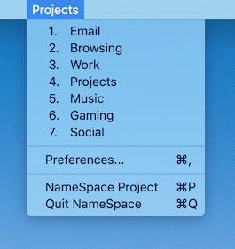

# NameSpace

For years I've been sending Apple feature requests to allow each Space to be given a user-defined name. Until that happens, I offer this app to help.

Note: This app requires that "Automatically rearrenge Spaces based on most recent use" and, only if you use multiple monitors, "Displays have separate Spaces", be turned OFF in System Mission Control prefs. For many, this is a deal killer, but not everyone has to use their Mac the same way. Maybe give this a try anyway, you may end up liking it.

NameSpace does these things:

	1) Allows you to name each Space
	2) Shows the name of your current Space in the menu bar
	3) Provides an alternate way to switch Spaces
	4) Navigates forward/back thru your Spaces history
	5) Creates Space-specific Finder folders

### Ok, but Why:

Spaces currently just labels each Space as "Desktop 1", etc. If you use dedicated Spaces for various tasks, you are left to your own devices for remembering which task is associated with which Space.

It may surprise you how it improves your ability to keep your computer life organized, especially if you have many different projects in flight at the same time.

### Operating Notes:

* "Customize Names" brings up a preference window to edit the names. You can also reorder names by dragging them up/down.
* To add / remove Spaces, use the system's built-in techniques, and this app should (perhaps after a delay) reflect the new setup, though you'll probably have to also assign a hotkey to any new spaces.
* If you would like it, the app can create a set of folders (kept in `~/Spaces`) for your convenience, to associated a folder with each space. Seems silly, but I find it very handy. I store aliases of folders, links, temp files, etc, relevant to a particular Space.

### Hotkeys, even while the app is in the background:

* `⌃⌥↓` shows the NameSpace menu, giving you an alternate way to jump to a space, or for bringing up the preferences.
* `⌃⌥←` and `⌃⌥→` go back or forward thru your Spaces selection history.

## Set up:
(Instructions shown for Sonoma)

In <b>System Settings → Desktop & Dock → Mission Control</b>:

* turn OFF "Automatically rearrenge Spaces based on most recent use"
* turn OFF "Displays have separate Spaces" (if using more than one display)

In <b>System Settings → Keyboard → Keyboard Shortcuts... → Mission Control → Mission Control</b> (not the checkbox but the submenu):

* Check ✔︎ each space you want to be using and assign a keyboard short-cut to each one that does not conflict with some other short-cut. (If it conflicts, you will see a warning triangle next to your choice.) The names will not match your selection in NameSpace, but that's ok. They will be labelled "Switch to Desktop 1" etc.

Lastly, in <b>System Settings → Privacy & Security</b>, grant permissions to NameSpace for Accessibility and Automation.

## Requirements:

* macOS 10.12 (Sierra) thru 14.x (Sonoma)

### License:

See LICENSE file. (TL;DR: MIT)

### Acknowledgements:

- Inspiration and a couple of methods from the [WhichSpace](https://github.com/gechr/WhichSpace) project, which has inspired a number of derivatives

–Jeff Biggus / HyperJeff, Inc
